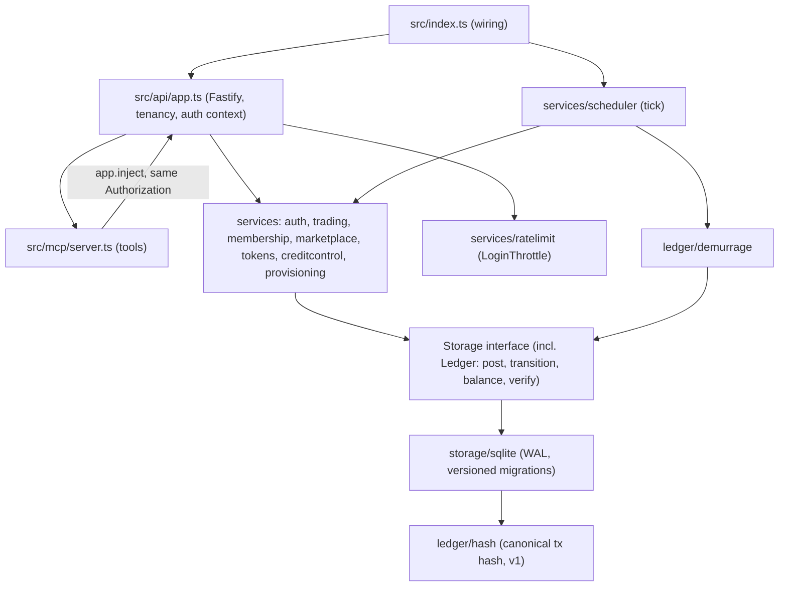
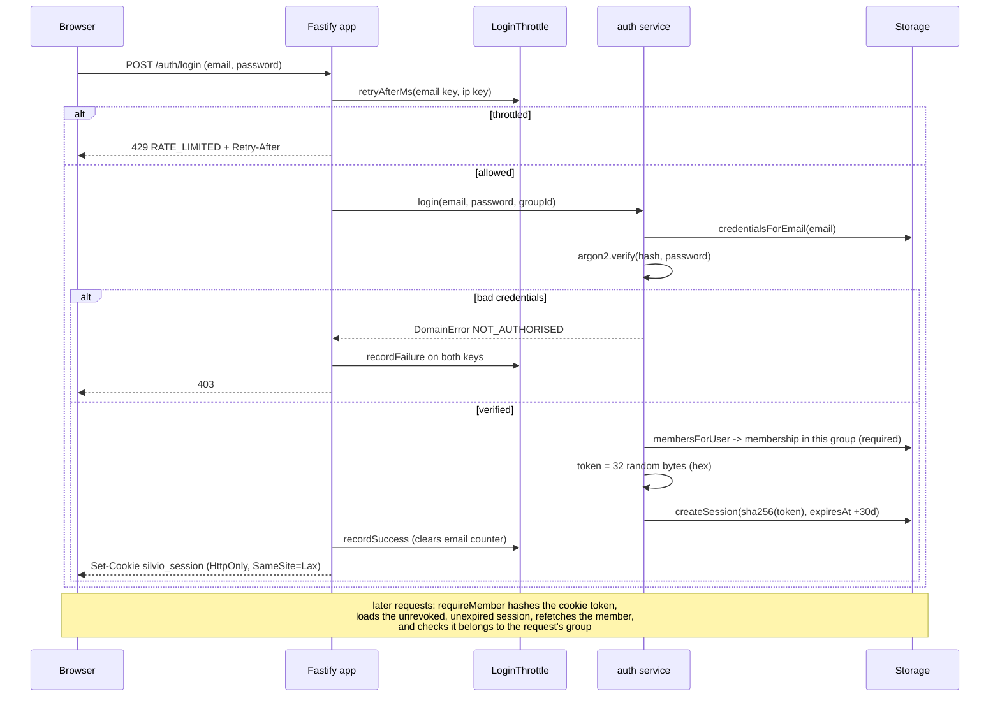
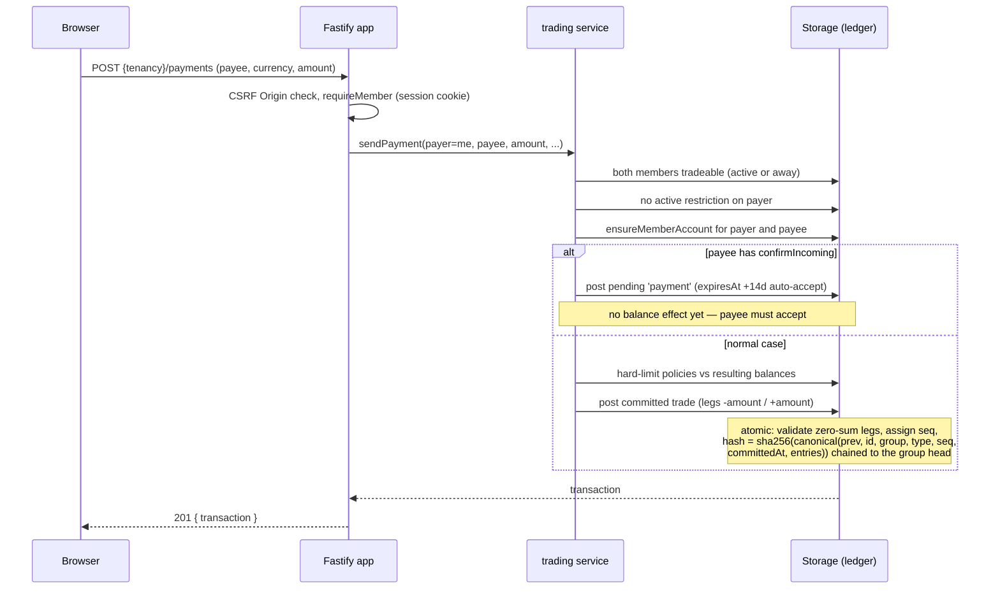
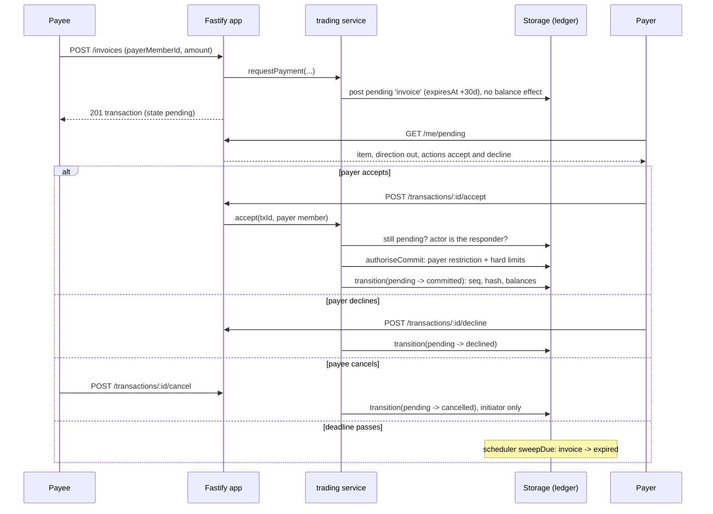
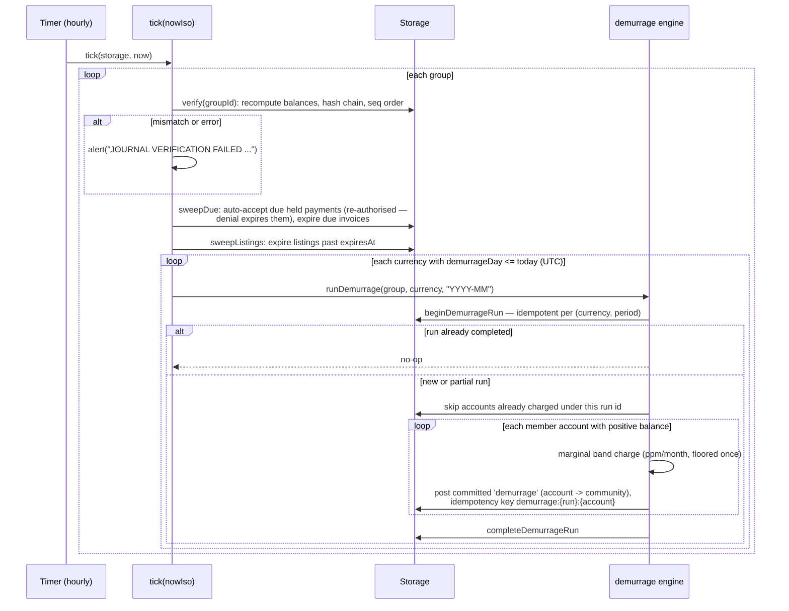
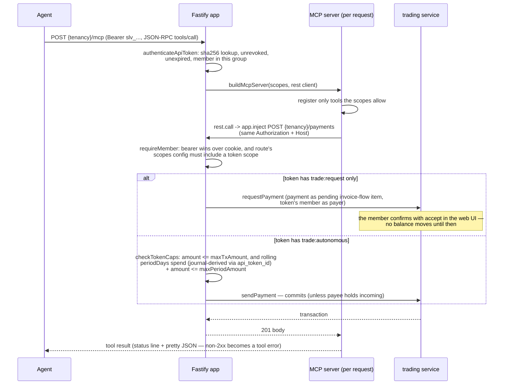

# Silvio server architecture

## Layering

The server is layered strictly: HTTP concerns live in the API layer, domain
rules in services and ledger logic, persistence behind a storage interface.
`src/index.ts` is wiring only — env config, storage construction, first-boot
operator bootstrap, app + scheduler startup, graceful shutdown.

- **API** (`src/api/app.ts`) — one Fastify app. Group tenancy is resolved per
  request, either from the Host header (custom domains via `group_domains`)
  or from the `/api/v1/g/:slug` path prefix; both resolve to the same route
  set. Operator routes (`/api/v1/operator/*`) sit outside any tenant.
  Handlers validate shapes (JSON Schema, which also feeds
  `@fastify/swagger`), establish the auth context, and delegate to services.
  A single error handler maps `DomainError` codes to HTTP statuses.
- **Services** (`src/services/*`) — domain logic: auth, membership lifecycle,
  trading, marketplace, credit control, API tokens, provisioning, login
  throttling, the scheduler. Services take a `Storage` and throw
  `DomainError` with member-facing messages.
- **Ledger** (`src/ledger/*`) — the core invariant, split between domain code
  (canonical transaction hash, demurrage band arithmetic) and the storage
  contract (`post`/`transition`/`balance`/`verify` in
  `src/storage/interface.ts`). Everything that moves value is a journal
  transaction.
- **Storage** (`src/storage/interface.ts`, `src/storage/sqlite/*`) — a
  pluggable interface; the SQLite implementation uses WAL mode, foreign keys
  on, and versioned migrations recorded in `schema_version` (a database
  stamped newer than the build is refused).
- **MCP** (`src/mcp/server.ts`) — tools for AI agents, implemented as a thin
  client of the REST API: every tool call is re-injected into the same
  Fastify app with the caller's Authorization header, so the MCP layer adds
  no authority of its own.

## Design principles

**Append-only, hash-chained journal** (`src/ledger/hash.ts`,
`SqliteStorage.post`/`verify`). Committed transactions are never mutated —
corrections are compensating `reversal` transactions with every leg negated.
Each commit gets a per-group sequence number and a sha256 over a canonical
JSON encoding (`hash_version` 1: deterministic key order, entries sorted by
account id) chained through the previous committed transaction's hash (`''`
for the first). The encoding lives in domain code, not storage, so any
backend must reproduce identical hashes and a storage migration preserves the
chain. `verify(groupId)` recomputes balances, the hash chain, and seq
contiguity from the journal and reports every mismatch.

**Double-entry with zero-sum legs.** `post` atomically validates each
transaction: at least two legs, non-zero safe-integer amounts, all accounts in
the transaction's group, and legs grouped by their account's currency must
each sum to zero. Balances are the sum of committed entries only. All amounts
are integers in currency minor units. `post` also takes an optional
per-group idempotency key: a replay returns the original transaction.

**Pending-transaction state machine** (decision #5). A transaction is either
born `committed` or `pending`; `transition` allows exactly `pending ->
committed | declined | cancelled | expired`. Only committing assigns
seq/hash/committedAt and takes balance effect, so pending transactions never
touch balances or the chain.

**Storage behind an interface, proven by a contract test.**
`test/storage/contract.ts` exports `storageContractTests(createStorage)`, a
suite of ledger and storage invariants parameterised over the backend; the
SQLite tests run it against `SqliteStorage`.

**Injected clocks — no test ever sleeps.** `tick(storage, nowIso)` takes time
explicitly (`startScheduler` is the thin wall-clock shim), `LoginThrottle`
methods take `nowMs`, `checkTokenCaps` takes `nowIso`, and sweeps take
`asOf`.

## Major operations

### Login and session cookie auth

Passwords are argon2id hashes; a session token is 32 random bytes (hex),
stored sha256-hashed, expiring after 30 days and revocable server-side.
Unknown email and wrong password produce the same message. Group login also
requires a membership in that group. Both login routes share
`checkThrottled`, a sliding-window lockout keyed per email (10 failures / 15
minutes) and per IP (30 / 15 minutes).

### Direct payment: POST /payments (cookie session)

### Invoice flow (the #5 state machine)

An invoice (`requestPayment`) is always pending — the payer authorises at
commit time, so restriction and hard-limit checks run in `accept`, not at
creation. Roles: the *responder* (payer of an invoice, payee of a held
payment) may accept or decline; the *initiator* may cancel. The scheduler's
`sweepDue` expires due invoices and auto-accepts due held payments (a
commit-time denial expires the hold instead).

### Scheduler tick

`tick(storage, nowIso)` is one idempotent pass over all groups; real
deployments run it hourly via `startScheduler`. Journal verification is
always on and never silent (decision #6): every tick verifies every group and
alerts loudly (default `console.error`, injectable) on any failure.

Demurrage (decision #1) is a marginal holding charge like income-tax bands:
each slice of a positive balance is charged at its band's `ratePpmPerMonth`,
integer arithmetic throughout, the total rounded down once in the member's
favour. Community, system, and gateway accounts are exempt; proceeds go to
the community account of the same currency. If the server was down on the
posting day, the next tick catches up.

### MCP tool call

The MCP endpoint lives at `{tenancy}/mcp` (streamable HTTP, stateless: a
fresh `McpServer` + transport per request, plain JSON responses, no session
ids). Auth is bearer-only. The tool list is filtered by the token's scopes,
but that is cosmetic — enforcement happens in the REST layer, which each tool
call re-enters via `app.inject` carrying the original Authorization and Host
headers.

Tools: `search_marketplace` and `list_categories` (always),
`member_directory` (`directory:read`), `my_account` / `my_statement` /
`pending_items` (`account:read`), `create_listing` (`listings:write`),
`send_payment` and `create_invoice` (either trade scope). Invoices created by
a token are always pending regardless of scope — the payer commits, so no cap
check applies.

## Data model

The schema (groups, currencies, accounts, transactions and entries, members
and persons, users and sessions, credit policies, listings, API tokens) is
specified in [../specs/data-model.md](../specs/data-model.md) and implemented
by the schema baseline in `src/storage/sqlite/schema.ts` (applied via
`migrations.ts`). It is not duplicated
here.

## Security

- **Passwords**: argon2id (library default), minimum 8 characters; one shared
  "email or password is incorrect" message prevents account enumeration.
- **Tokens hashed at rest**: session tokens and API tokens (`slv_` + 64 hex
  chars) are random values stored only as sha256 hashes; the raw API token
  appears exactly once, in the creation response.
- **CSRF**: session cookies are `HttpOnly` + `SameSite=Lax`; as a second
  layer, state-changing `/api/*` requests with an Origin header must match
  the Host (scheme deliberately ignored behind TLS-terminating proxies;
  absent Origin — curl, server-to-server — is allowed; unparseable Origin is
  rejected).
- **Login lockout**: in-memory sliding-window throttles per email (10
  failures / 15 min) and per IP (30 / 15 min); 429 with `Retry-After`;
  success clears the email counter only. In-memory by design for a
  single-process deployment — argon2 keeps each guess expensive regardless.
- **API token scopes and caps** (decision #9): a token acts as its member,
  with the issuing person as the acting user; a Bearer header takes
  precedence over any cookie. Routes opt in to token access by listing
  acceptable scopes in their config — routes without one (including all
  token-management routes) are cookie-only, so a token can never mint, list,
  or revoke tokens. `trade:autonomous` requires a per-transaction cap at
  grant time; the optional rolling-period cap is computed from committed
  journal entries tagged with the token id (`tokenSpend`), never from a
  mutable counter.
- **Tenancy isolation**: every group-scoped handler checks that the session,
  token, member, category, or transaction it touches belongs to the request's
  resolved group; cross-group lookups 404 rather than 403, so ids leak
  nothing.
