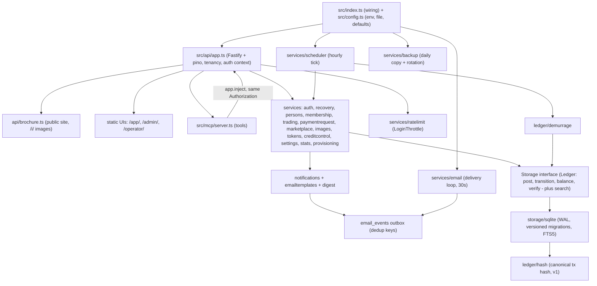
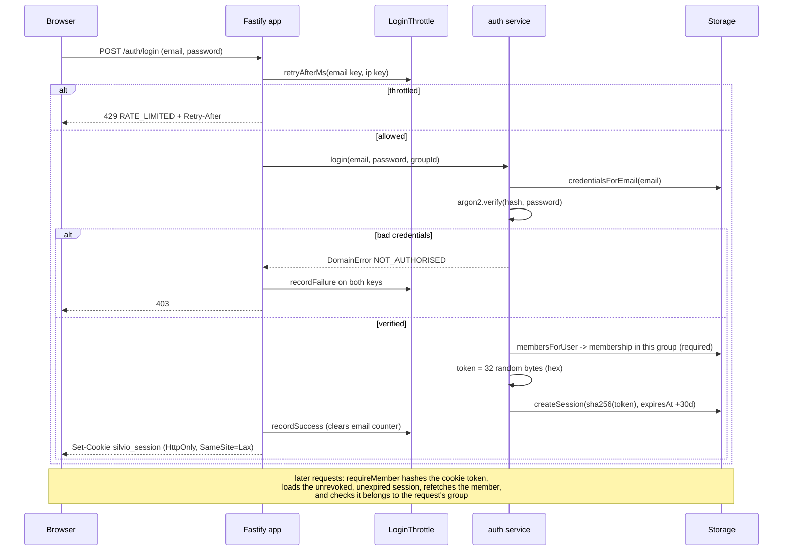
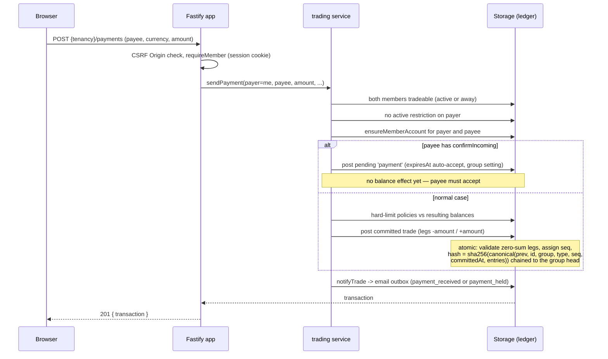
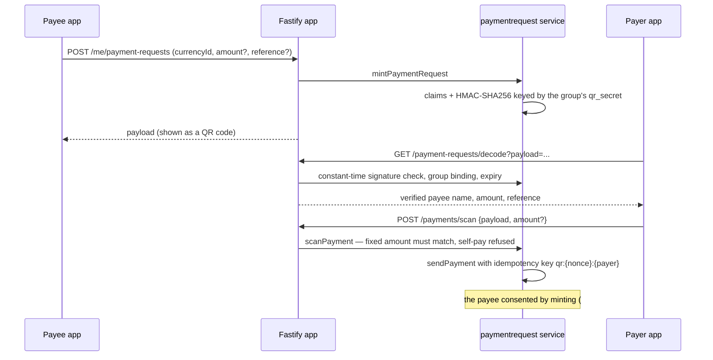
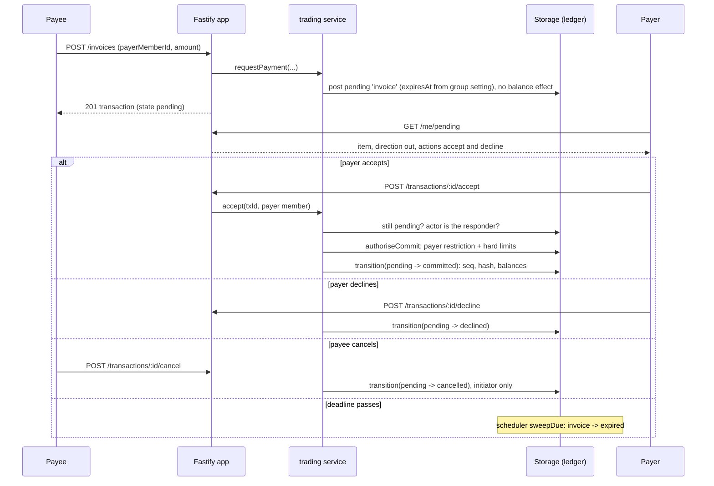
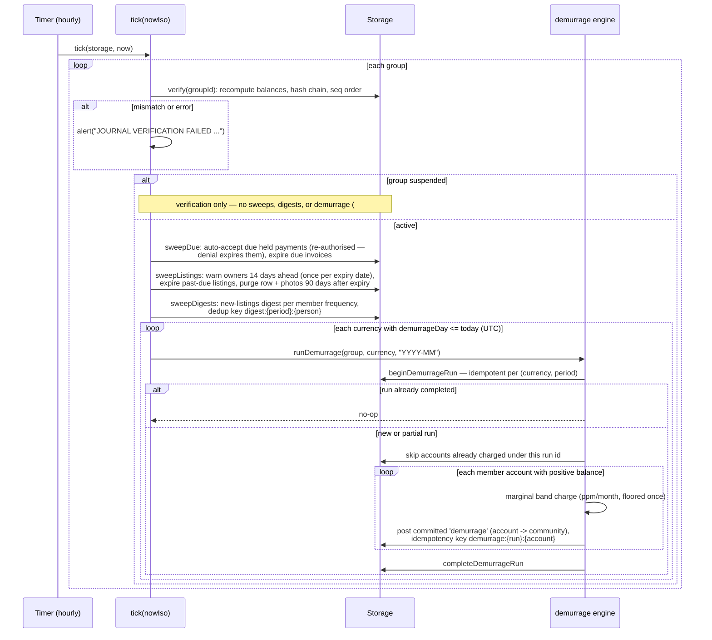
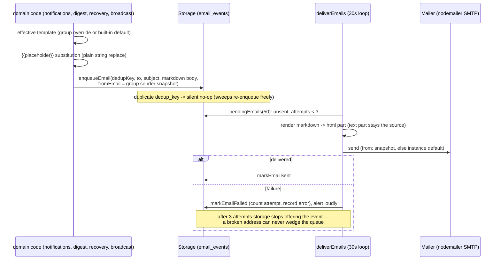
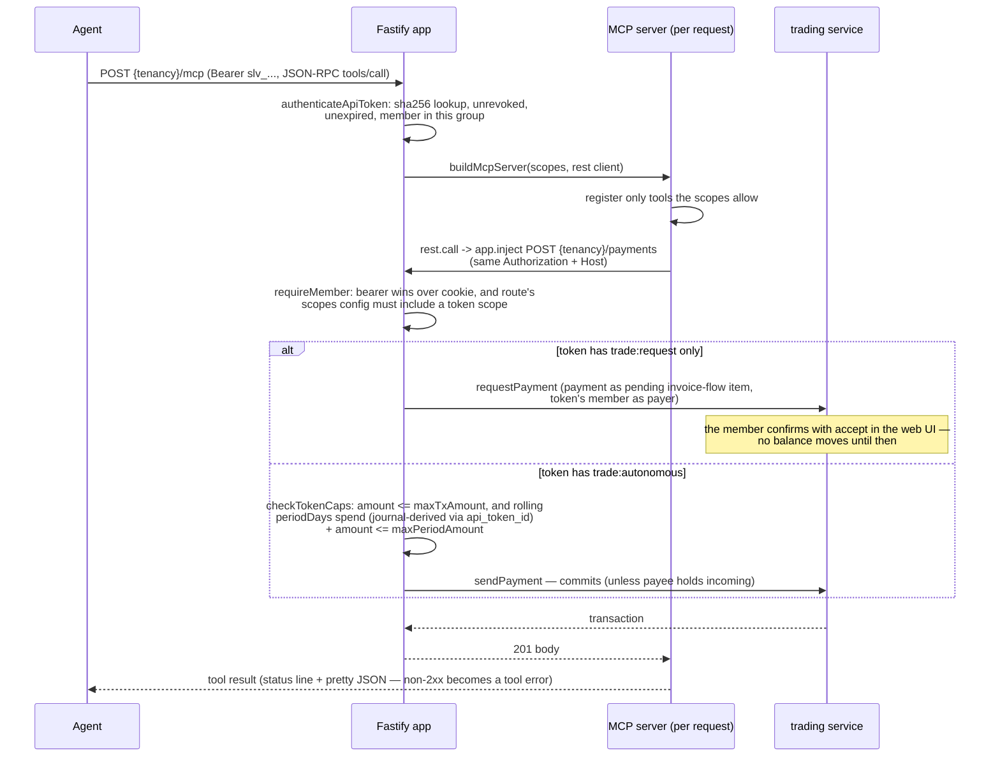

# Silvio server architecture

## Layering

The server is layered strictly: HTTP concerns live in the API layer, domain
rules in services and ledger logic, persistence behind a storage interface.
`src/index.ts` is wiring only — configuration, storage construction,
first-boot operator bootstrap (env vars, else an interactive TTY prompt, else
a loud warning — never a hang), UI dist discovery, app + scheduler startup,
the email delivery loop (when SMTP is configured), daily backups (when a
backup directory is configured), graceful shutdown. Configuration
(`src/config.ts`) is an optional JSON file with the same knobs as the
`SILVIO_*` env vars, precedence env > file > defaults; an unknown or
mistyped file key is a loud startup error, never a silent ignore. Logging is
Fastify's built-in pino at `SILVIO_LOG_LEVEL`; background jobs (scheduler,
email delivery, backups) alert through an injected `alert` wired to
`app.log.error`.

- **API** (`src/api/app.ts`) — one Fastify app carrying three surfaces:
  - The JSON API under `/api/v1`. Group tenancy is resolved per request,
    either from the Host header (custom domains via `group_domains`) or from
    the `/api/v1/g/:slug` path prefix; both resolve to the same route set.
    Operator routes (`/api/v1/operator/*`) sit outside any tenant. Handlers
    validate shapes (JSON Schema, which also feeds `@fastify/swagger`),
    establish the auth context, and delegate to services. A single error
    handler maps `DomainError` codes to HTTP statuses.
  - The server-rendered public brochure site at each group's root
    (`src/api/brochure.ts`), plus image serving at `/i/{id}`.
  - Static serving for the three built UI packages: member app at `/app/`,
    admin at `/admin/`, operator console at `/operator/`, each with SPA
    fallback via the not-found handler.
- **Services** (`src/services/*`) — domain logic: auth and account recovery,
  household persons and invites, membership lifecycle, trading, signed QR
  payment requests, marketplace and listing shelf life, credit control,
  images, notifications + email templates + digest, outbound email delivery,
  group settings, admin stats, the audit trail, API tokens, provisioning,
  login throttling, backups, the scheduler. Services take a `Storage` and
  throw `DomainError` with member-facing messages.
- **Ledger** (`src/ledger/*`) — the core invariant, split between domain code
  (canonical transaction hash, demurrage band arithmetic) and the storage
  contract (`post`/`transition`/`balance`/`verify` in
  `src/storage/interface.ts`). Everything that moves value is a journal
  transaction.
- **Storage** (`src/storage/interface.ts`, `src/storage/sqlite/*`) — a
  pluggable interface; the SQLite implementation uses WAL mode, foreign keys
  on, and versioned migrations recorded in `schema_version` (a database
  stamped newer than the build is refused). Full-text search is an FTS5
  index maintained by triggers (see Search below).
- **MCP** (`src/mcp/server.ts`) — tools for AI agents, implemented as a thin
  client of the REST API: every tool call is re-injected into the same
  Fastify app with the caller's Authorization header, so the MCP layer adds
  no authority of its own.

## The public face: brochure, app shell, chrome

Each group's root is a **server-rendered public brochure** (decision #12) —
indexable, link-previewable, near-zero JS — and the member app renders
inside the same visual shell when logged in. One origin, so the session
cookie is shared: the brochure header knows who you are.

- **Routes** (`src/api/brochure.ts`): `/` (a placeholder welcome until an
  admin authors a CMS page with slug `home`, which then owns the front
  page), `/p/{slug}` for CMS pages, `/news` (items published by now and not
  expired), `/market` (read-only browse of active listings — titles,
  categories, badges, photos, never member contact details), and `/i/{id}`
  image serving. Tenancy comes from the Host header exactly as for the API;
  a host that resolves to no group gets a minimal 404 page.
- **CMS content is markdown, rendered server-side** (decision #13) by
  markdown-it with `html: false`: raw HTML in the source is escaped, so the
  output can only contain markup generated from markdown constructs — no
  sanitiser pass, ever. Markdown images render as `` only for
  `/i/{uuid}` sources (decision #14); anything else, external URLs included,
  degrades to visible text. Pages carry a visibility tier (`public` |
  `members` | `admin`); a page the viewer may not see 404s exactly like a
  missing one, and the shell nav lists only visible pages.
- **Session-aware chrome**: the brochure header shows the group brand (logo
  and header image from the image store's `brand` slots, #15), the nav, and
  the session corner; an invalid, expired, or foreign-group cookie renders
  the logged-out header rather than erroring. The chrome is *progressive*:
  hidden entirely in the installed PWA via the `display-mode: standalone`
  media query.
- **The app is served raw at `/app/`** (#15, amending #12's server-side
  injection): index.html is read once and served untouched, for `/app/`
  itself and for every deep link via the not-found fallback. Injection was
  dropped because the service worker answers every post-first-visit `/app/*`
  navigation from its precached index.html — injected chrome would never
  reach a returning user. Instead the React app renders the same slim chrome
  itself from the public, session-aware **`GET /shell`** endpoint: group
  name and slug, branding image ids, the viewer's visible nav pages, the
  member's display name (with an `acting` flag, #24), and a `suspended` flag
  (#20). The accepted cost: the chrome exists twice — server template and
  React component — and must stay visually in step.
- **Suspension is honest to visitors** (#20): every brochure page of a
  suspended group carries a notice banner under the header, and the market
  browse is replaced by the notice entirely.

## Design principles

**Append-only, hash-chained journal** (`src/ledger/hash.ts`,
`SqliteStorage.post`/`verify`). Committed transactions are never mutated —
corrections are compensating `reversal` transactions with every leg negated
(admin-only, surfaced as a transaction search with per-row reversal; a
reversal cannot itself be reversed). Each commit gets a per-group sequence
number and a sha256 over a canonical JSON encoding (`hash_version` 1:
deterministic key order, entries sorted by account id) chained through the
previous committed transaction's hash (`''` for the first). The encoding
lives in domain code, not storage, so any backend must reproduce identical
hashes and a storage migration preserves the chain. `verify(groupId)`
recomputes balances, the hash chain, and seq contiguity from the journal and
reports every mismatch.

**Double-entry with zero-sum legs.** `post` atomically validates each
transaction: at least two legs, non-zero safe-integer amounts, all accounts in
the transaction's group, and legs grouped by their account's currency must
each sum to zero. Balances are the sum of committed entries only. All amounts
are integers in currency minor units. `post` also takes an optional
per-group idempotency key: a replay returns the original transaction.

**Pending-transaction state machine** (decision #5). A transaction is either
born `committed` or `pending`; `transition` allows exactly `pending ->
committed | declined | cancelled | expired`. Only committing assigns
seq/hash/committedAt and takes balance effect, so pending transactions never
touch balances or the chain.

**Per-group settings are resolved, never migrated.** `group.settings` is a
JSON blob of optional knobs; `effectiveSettings` (`src/services/settings.ts`)
fills platform defaults — auto-accept 14 days, invoice expiry 30 days,
digest weekly, listing shelf life 180 days, transparency `none` — so
consumers only ever see effective values and adding a knob never migrates a
group row.

**Suspended groups are read-only** (decision #20). One `onRequest` hook in
the tenancy plugin refuses every state-changing method with
`GROUP_SUSPENDED`, matched on the route pattern minus the plugin prefix so
both tenancy modes behave identically. `/auth/*` stays open (account access
is user-level, not group-level) and the `/mcp` envelope passes through —
its re-injected REST calls hit the same hook, so writes stay blocked while
read tools keep working. Logins, reads, and the brochure stay up; the
scheduler skips a suspended group's sweeps, digests, and demurrage but
never its journal verification — suspension must not mask corruption.

**Idempotency by durable keys, not remembered state.** Sweeps rerun every
tick and delivery retries are routine, so repeatable effects carry stable
keys: every email enqueue has a dedup key unique in `email_events` (a
re-enqueue is a silent no-op), demurrage postings key on run and account, QR
scans key on nonce and payer. The rolling API-token spend is derived from
journal rows tagged `api_token_id`, never a mutable counter.

**Storage behind an interface, proven by a contract test.**
`test/storage/contract.ts` exports `storageContractTests(createStorage)`, a
suite of ledger and storage invariants parameterised over the backend; the
SQLite tests run it against `SqliteStorage`.

**Injected clocks — no test ever sleeps.** `tick(storage, nowIso)` takes time
explicitly (`startScheduler` is the thin wall-clock shim, as are
`startEmailDelivery` and `startBackups` for their loops), `LoginThrottle`
methods take `nowMs`, `checkTokenCaps` takes `nowIso`, and sweeps —
trades, listings, digests, email delivery, backups — take an explicit
now/asOf.

## Major operations

### Login and session cookie auth

Passwords are argon2id hashes; a session token is 32 random bytes (hex),
stored sha256-hashed, expiring after 30 days and revocable server-side.
Unknown email and wrong password produce the same message. Group login also
requires a membership in that group. Both login routes share
`checkThrottled`, a sliding-window lockout keyed per email (10 failures / 15
minutes) and per IP (30 / 15 minutes).

### Recovery, verification, and invites

Password reset, email verification, and household invites (decision #23)
share one mechanism: `one_time_tokens` — opaque `randomBytes` values,
sha256-hashed at rest like sessions, single-use (`usedAt`) with per-purpose
expiry (reset 1 hour, verify and invite 7 days). Unknown, wrong-purpose,
used, and expired tokens all fail with one message — no oracle — and
requesting a reset for an unknown email is a silent no-op, so nothing
discloses whether an address has an account. Emailed links point back at the
requesting host (`baseUrlFrom`), and the emails ride the template pathway
but are rendered directly (`recovery.ts`, `persons.ts`) rather than via the
member-notification helper: the recipient is a user — or not yet even that
— rather than a member.

Household persons (#23): any person on a membership manages its people via
`/me/persons`. Adding an email that already has a Silvio account links
immediately; otherwise an invite email carries the token and
`POST /auth/accept-invite {token, password}` creates the user (counting as
email verification — the link proved the address) and links every unlinked
person row with that email, so an address invited onto two memberships joins
both. Guard rails: the last person cannot be removed; removal revokes the
departed person's sessions in this member context and the API tokens they
issued for it (their Silvio login survives); adds and removes are audited.
A second person flips an `individual` membership to `joint`, never back.

### Direct payment: POST /payments (cookie session)

### Signed QR payment requests (decision #22)

The QR flow upgrades #5's "a QR is an invoice" from client-encoded JSON to
server-minted, signed, idempotent payloads
(`src/services/paymentrequest.ts`). The payload is
`base64url(JSON claims) + '.' + base64url(HMAC-SHA256)`, signed with a
per-group `qr_secret` minted at group creation and never leaving the server.
Claims carry payee, currency, an optional amount (fixed for an invoice, open
for a stall or donation QR where the payer enters it), optional reference
and expiry (none by default — a printed stall code should keep working), and
a nonce. What the signature buys is a trustworthy confirm screen: the
payer's app decodes via the server and shows *verified* payee name, amount
and reference; a payload that fails verification or names another group is
rejected outright.

Restrictions and credit-control authorisation apply exactly as for any
payment; scans are ordinary `trade` transactions, channel `web`.

### Invoice flow (the #5 state machine)

An invoice (`requestPayment`) is always pending — the payer authorises at
commit time, so restriction and hard-limit checks run in `accept`, not at
creation. Roles: the *responder* (payer of an invoice, payee of a held
payment) may accept or decline; the *initiator* may cancel. The scheduler's
`sweepDue` expires due invoices and auto-accepts due held payments (a
commit-time denial expires the hold instead). Every transition enqueues its
notification through the outbox, dedup-keyed to the transaction id so the
repeating sweep never double-sends.

### Scheduler tick

`tick(storage, nowIso)` is one idempotent pass over all groups; real
deployments run it hourly via `startScheduler`. Journal verification is
always on and never silent (decision #6): every tick verifies every group —
including suspended ones — and alerts loudly (injectable, wired to
`app.log.error`) on any failure. Everything else is skipped for a suspended
group (#20).

Demurrage (decision #1) is a marginal holding charge like income-tax bands:
each slice of a positive balance is charged at its band's `ratePpmPerMonth`,
integer arithmetic throughout, the total rounded down once in the member's
favour. Community, system, and gateway accounts are exempt; proceeds go to
the community account of the same currency. If the server was down on the
posting day, the next tick catches up.

Listing shelf life (decision #18) keeps the market honest: new listings get
`expiresAt = now + listingMaxAgeDays` (group setting, default 180 days;
an explicit expiry wins), owners get one warning email per (listing, expiry
date), `POST /listings/{id}/renew` resets the clock to a full shelf life —
within the purge window it also revives an expired listing — and 90 days
after expiry the sweep hard-deletes the row and its photos: expired listings
are clutter, not ledger history.

### Outbound email

Email is an outbox, split in two (decisions #16, #17): domain code composes
`email_events` rows and delivery is a separate loop, so notifications work —
and queue — whether or not SMTP is configured.

- **Templates** (#16): every notification kind has a built-in default in
  code (`emailtemplates.ts`); a group overrides per kind via
  `email_templates` rows (deleting the row reverts, so new kinds appear for
  every group without data migration). Bodies are markdown with
  `{{placeholder}}` substitution — substitution happens *before* markdown
  rendering, so markdown-it's escaping applies to substituted values and
  member-supplied names can't inject markup; unknown placeholders pass
  through literally. Delivery is multipart: the substituted source is the
  `text/plain` part and its rendering the `text/html` part, so
  `email_events.body` stores readable source.
- **Recipient fan-out**: member-facing notifications enqueue one email per
  person on the membership with an email address; dedup keys are stable per
  (event, person).
- **Per-group sender**: `groups.email_from` is snapshotted onto each event
  at enqueue time; delivery falls back to `SILVIO_EMAIL_FROM`.
  Deliverability for the chosen domain is the operator's problem,
  documented, not policed.
- **Digest** (#17): a scheduler sweep sends each active member, per their
  `digestFrequency` (`none | weekly | monthly`), the listings created since
  the start of the *previous* period — windows deliberately overlap so
  nothing falls between sweeps, and the per-period dedup key makes both
  reruns and the overlap harmless. An empty digest is not sent.
- **Broadcast** (#17): `POST /admin/broadcast {subject, body}` — one email
  per person on every active membership, queued through the same outbox
  under a fresh broadcast id. No template and no storage of its own: a
  broadcast is ad hoc, and `email_events` already records what went to whom.

### MCP tool call

The MCP endpoint lives at `{tenancy}/mcp` (streamable HTTP, stateless: a
fresh `McpServer` + transport per request, plain JSON responses, no session
ids). Auth is bearer-only. The tool list is filtered by the token's scopes,
but that is cosmetic — enforcement happens in the REST layer, which each tool
call re-enters via `app.inject` carrying the original Authorization and Host
headers.

Tools: `search_marketplace` and `list_categories` (always),
`member_directory` (`directory:read`), `my_account` / `my_statement` /
`pending_items` (`account:read`), `create_listing` (`listings:write`),
`send_payment` and `create_invoice` (either trade scope). Invoices created by
a token are always pending regardless of scope — the payer commits, so no cap
check applies.

### Acting for a member (decision #24)

An admin can act for a member — the offline-member cure — without a second
login or shared password: `POST /admin/members/{id}/act-as` stamps
`acting_member_id` on the admin's *own* session row, `POST /me/stop-acting`
clears it. While acting, `authenticate` resolves the session's member to the
target for every member-scoped route (the admin sees the member's app
exactly as they would) but `auth.user` stays the admin — attribution never
lies: ledger rows created while acting carry the admin as `createdBy`, and
both ends plus in-between actions are audited with `acting_for_member_id`.
Impersonation cannot escalate: issuing API tokens and managing household
persons are refused while acting (`refuseWhileActing` — they grant account
access), and admin routes 403 by themselves because the session presents as
the member, who is not an admin. `/me` and `/shell` carry the acting state
so the member app can show its persistent banner.

## Images

One general blob store (decision #14, amended by #15): an `images` table —
uuid, group, `owner_kind`, optional `owner_id`, mime, size, blob — with four
owner kinds and per-kind rules enforced in `src/services/images.ts`:

- `cms` — admin-uploaded, referenced from markdown by URL (2MB cap);
- `member` — exactly one profile photo, replace-on-upload (256KB);
- `listing` — up to five per listing, owner-managed, upload order (1MB);
- `brand` (#15) — one image per slot, `owner_id` naming the slot
  (`logo` | `header`), replace-on-upload (1MB). Group skinning is derived
  entirely from these rows — no columns on `groups`.

The client resizes, the server only validates: a server-side image pipeline
means a heavy native dependency (sharp), wrong for the minimal-VPS posture.
Validation is a magic-byte sniff that must match the claimed mime against a
jpeg/png/webp whitelist, the per-kind byte cap, and a per-group total quota
(500MB constant for now). Replace-on-upload flows create the new image first
and delete the old after, so a failed upload never loses the previous one.
Upload transport is the raw request body with the image content type (a
dedicated Fastify content-type parser for `image/*`), not multipart.

Serving is `GET /i/{id}`: correct Content-Type, `nosniff`, and
`Cache-Control: public, max-age=31536000, immutable` — an id's content never
changes because a re-upload mints a new id, so repeat views are browser
cache hits. Access control is the unguessable UUID, no session check: CMS
and listing images are public-brochure content anyway.

## Search

One FTS5 table, `search_index` (title, body, plus unindexed domain /
entity_id / group_id), kept in sync by insert/update/delete triggers on the
four searchable domains: listings, members (directory), pages, news. The
index deliberately carries **text only** — no status or visibility columns —
because tier rules live in `storage.search()`'s JOIN back to the live source
row, so a status or visibility flip needs no index write. Per-domain rules:
listings and directory join on `status = 'active'`; pages join on the
caller's visibility tier; news joins on the published/not-expired window.

The API surface is a single public `GET /search?domain=&q=` endpoint. The
optional session sets the tier: no session searches the public face, a
member adds the directory and member pages, an admin sees admin pages too —
and the directory returns an empty page to public callers rather than an
error. Results are ranked bm25 with uuidv7 entity id as the newest-first
tie-break, snippets from FTS5, paginated with a total.

## Audit trail

`audit_events` is append-only by contract — rows are only ever inserted:
actor user id, action, entity type/id, opaque JSON detail, and a nullable
`group_id` so platform-level (operator) events fit the same table.
`acting_for_member_id` records impersonation (#24). `recordAudit`
(`src/services/audit.ts`) stamps the timestamp and **never throws** — an
audit failure must not fail the action it records; it logs and moves on.
Lifecycle transitions, restrictions, reversals, broadcasts, person
add/remove, act-as/stop-acting, and every operator group change are audited;
admins read their group's trail at `GET /admin/audit` (newest first,
filterable), operator events carry the operator as actor.

## Backups

`src/services/backup.ts`: one integrity-checked SQLite copy per UTC day,
checked hourly (and immediately at boot, to pick up a missed day after a
restart). The copy is taken via SQLite's online backup API — safe against a
live database — written to a temp file, `PRAGMA integrity_check`ed, and only
then renamed to `silvio-YYYY-MM-DD.sqlite`, so a bad copy never lands under
a daily name (it is deleted, loudly). Rotation keeps the union of the 7
newest dailies and the 4 newest Monday-dated files. Off unless
`SILVIO_BACKUP_DIR` is set; `src/backup-now.ts` is the manual entry point.

## Operator tier

The platform tier (decisions #2, #20, #21) is a different principal, not a
mode: operators are users with `is_operator` set, never members, holding
group-less sessions from `POST /api/v1/operator/login` (which checks the
operator flag *before* opening any session, so a failed operator login
leaves no usable cookie). `requireOperator` gates host-independent routes
outside any tenant: provision a group (slug, name, first currency, optional
initial admin), list groups with status/plan/domains, `PATCH
/operator/groups/{id}` (name, status, plan label, operator-private notes —
kept out of the shared Group schema so they can never serialize past
operator routes), and domain add/remove. Every actual change is audited with
the operator as actor. The operator console is the third UI package,
`ui/operator`, served at `/operator/` with the same static + SPA-fallback
pattern as the admin app. Suspension is the operator's pressure lever
without hostage-taking: read-only semantics (see Design principles) mean
members never lose access to their own records.

## Transparency and reports

Publishing member balances is a group's explicit cultural choice, never a
platform default (decision #19): with `transparency: 'balances'` set,
`GET /balances` returns every active member's balance and 12-month turnover
per currency to members only; with it off the route 404s exactly like a
feature that doesn't exist. Admin dashboards get `GET /admin/stats`
(`src/services/stats.ts`): balance distribution, 12 months of monthly trade
flow, velocity (30-day volume over positive money supply), and a dormancy
list (active members with no trade in 90 days, never-traded first) — all
composed from storage aggregates; the UI draws the graphs. Admins also get
journal oversight: `GET /admin/transactions` (filterable by member,
currency, type, state, and text) with per-row reversal via
`POST /admin/transactions/{id}/reverse`.

## Data model

The schema (groups and domains, currencies and demurrage, accounts,
transactions and entries, members and persons, users, sessions and one-time
tokens, credit policies and restrictions, listings and categories, API
tokens, email events and templates, CMS pages and news, images, audit
events, and the search index) is specified in
[../specs/data-model.md](../specs/data-model.md) and implemented by the
schema baseline in `src/storage/sqlite/schema.ts` (applied via
`migrations.ts`; pre-release migrations were flattened into baseline
version 1). It is not duplicated here.

## Security

- **Passwords**: argon2id (library default), minimum 8 characters; one shared
  "email or password is incorrect" message prevents account enumeration.
- **Tokens hashed at rest**: session tokens, API tokens (`slv_` + 64 hex
  chars), and one-time tokens (reset/verify/invite) are random values stored
  only as sha256 hashes; the raw API token appears exactly once, in the
  creation response. A password reset revokes every open session, and the
  forgot-password throttles are separate instances from the login pair so a
  mail-bomber cannot lock the victim's login.
- **CSRF**: session cookies are `HttpOnly` + `SameSite=Lax`; as a second
  layer, state-changing `/api/*` requests with an Origin header must match
  the Host (scheme deliberately ignored behind TLS-terminating proxies;
  absent Origin — curl, server-to-server — is allowed; unparseable Origin is
  rejected). Routes opt out only via explicit config (`/auth/forgot`, whose
  worst cross-site effect is a throttled email to the account owner).
- **Login lockout**: in-memory sliding-window throttles per email (10
  failures / 15 min) and per IP (30 / 15 min); 429 with `Retry-After`;
  success clears the email counter only. In-memory by design for a
  single-process deployment — argon2 keeps each guess expensive regardless.
- **API token scopes and caps** (decision #9): a token acts as its member,
  with the issuing person as the acting user; a Bearer header takes
  precedence over any cookie. Routes opt in to token access by listing
  acceptable scopes in their config — routes without one (including all
  token-management routes) are cookie-only, so a token can never mint, list,
  or revoke tokens. `trade:autonomous` requires a per-transaction cap at
  grant time; the optional rolling-period cap is computed from committed
  journal entries tagged with the token id (`tokenSpend`), never from a
  mutable counter. Every authenticated token request also counts against a
  per-token sliding-window allowance (default 60/minute) — an anti-runaway
  guard, not a quota.
- **QR payloads** (decision #22): HMAC-SHA256 with a per-group secret that
  never leaves the server, constant-time comparison, group binding and
  expiry checked before anything is shown. It cannot stop a payee lying on a
  sticker; the displayed, verified payee name is the defence.
- **Acting is bounded** (decision #24): access-granting routes refuse while
  acting, admin routes 403 because the session presents as the member, and
  `auth.user` stays the admin so attribution and the audit trail never lie.
- **Uploads validated by content**: magic-byte sniff must match the claimed
  mime against a jpeg/png/webp whitelist, per-kind byte caps and a group
  quota bound the damage; served with `nosniff` and access by unguessable
  UUID. Client-side canvas re-encoding also strips EXIF — no GPS
  coordinates in profile photos.
- **Markdown never trusts input**: `html: false` everywhere (CMS, news,
  email HTML parts), link protocols validated, image sources allowlisted to
  `/i/{uuid}` — external images stay blocked permanently.
- **Operator separation** (#20/#21): operator routes require the operator
  flag on a group-less session checked before any cookie is set; operator
  notes never serialize through tenant-facing schemas.
- **Tenancy isolation**: every group-scoped handler checks that the session,
  token, member, category, or transaction it touches belongs to the request's
  resolved group; cross-group lookups 404 rather than 403, so ids leak
  nothing. Suspension enforcement (#20) rides the same tenancy hook.
