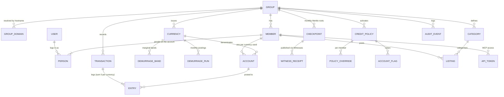

# Silvio — Data Model Specification

Draft v0.1, 2026-07-08. Derives from [decisions.md](decisions.md) #1–#10; decision
numbers cited throughout. This is a logical model — concrete DDL belongs to the
storage implementation (#6: balance caching, indexing strategy etc. are the
storage layer's private decisions).

## Conventions

- **IDs**: UUIDv7 (time-ordered) primary keys everywhere. Sortable, opaque,
  merge-safe if instances are ever combined, and federation-friendly (#4).
- **Money**: signed 64-bit integers in **minor units**; `currency.scale` defines
  the decimal point. No floats in any money path (#6).
- **Rates**: integers in parts-per-million (ppm) — e.g. 1%/month = 10 000 ppm.
- **Tenancy**: every domain table carries `group_id`; all unique constraints are
  scoped by it (#2). Rows never reference rows of another group (enforced in the
  repository layer).
- **Timestamps**: UTC, `*_at` naming. Soft lifecycle via status + timestamp
  columns; the journal is the only append-only store — other entities may be
  updated but money history may not (#6).
- `JSON` columns are used only where a structure is policy-defined and opaque to
  the schema (pluggable credit-control config, #3).

## Entity overview



## 1. Tenancy & identity (#2)

### group
| field | type | notes |
|---|---|---|
| id | uuid | |
| slug | text | unique; default subdomain |
| name | text | display name |
| branding | json | logo ref, theme colours (white-label) |
| settings | json | group toggles: transparency options (#3), pending auto-accept days (#5, default 14), invoice expiry days, digest defaults |
| plan, status | text | reserved for SaaS billing (#2); status: active \| suspended |
| created_at | ts | |

### group_domain
Hostname → tenant resolution for white-label custom domains.
`(hostname unique) → group_id`.

### user — global auth identity
| field | type | notes |
|---|---|---|
| id | uuid | |
| email | text | unique globally; login identifier |
| email_verified_at | ts? | |
| password_hash | text? | argon2id; nullable if passkey-only |
| totp_secret | text? | 2FA |
| is_operator | bool | platform super-admin (#2); never listed in groups |
| status | text | active \| locked \| closed |
| created_at, last_login_at | ts | login throttling/lockout tracked alongside |

### passkey
WebAuthn credentials: `id, user_id, credential_id, public_key, sign_count,
label, created_at, last_used_at`.

### member — a membership of a group (#2, #7)
| field | type | notes |
|---|---|---|
| id | uuid | |
| group_id | uuid | |
| member_no | int | per-group unique, human-friendly ("account number") |
| type | text | individual \| joint \| organisation |
| display_name | text | directory name |
| role | text | member \| committee \| admin (group-level; #2) |
| status | text | applied \| active \| away \| suspended \| closed (#7 lifecycle) |
| about, photo_ref | | profile |
| neighbourhood | text? | coarse location for directory filtering (CamLETS grid pattern); full address lives on person |
| digest_frequency | text | none \| weekly \| monthly — offers/wants digest |
| confirm_incoming | bool | opt-in payment confirmation (#5) |
| applied_at, approved_at, closed_at | ts? | |
| anonymised_at | ts? | GDPR erasure marker (#7): person/user data scrubbed, accounts persist |

### person — a human on a membership (#7)
| field | type | notes |
|---|---|---|
| id | uuid | |
| member_id | uuid | |
| user_id | uuid? | nullable — offline members have no login (buddy-managed) |
| is_primary | bool | one per member |
| name, email, phones, address… | | contact details |
| email_visibility, phone_visibility, address_visibility | text | members \| admin (field-level tiers; postcode shown partially to public is presentation policy) |

A `user` may be a `person` in many groups; a `member` may have several people
(joint/household). Notification preferences beyond the digest sit on person
(emails go to people).

## 2. Currency & demurrage (#1)

### currency
| field | type | notes |
|---|---|---|
| id | uuid | |
| group_id | uuid | |
| code | text | per-group unique, e.g. "CAM" |
| name, symbol | text | |
| scale | int | decimal places (0 for whole units) |
| unit_name | text? | "hour" mode etc. |
| kind | text | mutual \| voucher \| bookkeeping — vouchers/mixed-fee currencies (#6); informational, same ledger rules |
| demurrage_day | int? | day-of-month for posting run; null = demurrage off |
| rate_ref | json? | reserved: exchange-rate hint for federation (#4); no logic now |
| created_at, retired_at | ts | |

### demurrage_band (#1)
Marginal, tax-like: `id, currency_id, from_amount (minor units),
rate_ppm_per_month`. Ordered by `from_amount`; first band typically 0 ppm
(free-base). Admin-editable; effective from next run.

### demurrage_run (#1)
Idempotency + audit for the monthly posting: `id, group_id, currency_id, period
("YYYY-MM", unique per currency), status (running | completed), started_at,
completed_at`. Each charge is a normal `transaction` (type `demurrage`,
`demurrage_run_id` set); re-running a completed period is a no-op, recovery
re-processes only accounts without a posted charge in the run.

## 3. Ledger (#5, #6)

### account
| field | type | notes |
|---|---|---|
| id | uuid | |
| group_id | uuid | |
| currency_id | uuid | an account holds exactly one currency — a leg's currency is implicit via its account (#6) |
| type | text | member \| community \| system \| gateway |
| member_id | uuid? | for member accounts; unique (member_id, currency_id) |
| counterparty_ref | text? | gateway accounts: which external group/node (#4) |
| created_at, closed_at | ts | closed accounts persist as ledger counterparties (#7) |

Exactly one `community` account per currency (demurrage proceeds #1, leaver
settlement #7). `gateway` accounts are demurrage- and policy-exempt (#1, #3).

### transaction (header)
| field | type | notes |
|---|---|---|
| id | uuid | |
| group_id | uuid | all legs' accounts belong to this group (#2, #6) |
| type | text | trade \| demurrage \| fee \| settlement \| reversal \| adjustment |
| flow | text? | payment \| invoice — who initiated, drives confirmation (#5) |
| state | text | pending \| committed \| declined \| cancelled \| expired (#5) |
| seq | int? | per-group chain index, assigned at commit — 1:1 with the hash chain (#10); statements order by it; verify() checks seq order == chain order |
| description, reference | text | member-entered |
| created_by | uuid | person id (or system); channel: web \| mcp \| admin \| system |
| api_token_id | uuid? | when channel = mcp (#9 audit) |
| reverses_id | uuid? | compensating link (#5, #6) |
| demurrage_run_id | uuid? | (#1) |
| remote_ref | text? | opaque external ref for gateway trades (#4) |
| idempotency_key | text? | unique per group; replays return the original (#6) |
| hash, hash_version | text?, int? | journal hash chain (#10): set at commit, `H(prev_hash ‖ canonical(header+entries))` over a byte-stable versioned encoding; chain links by prev_hash, not seq arithmetic |
| created_at, committed_at, expires_at | ts | expiry for pending items (#5) |

### entry (legs)
`id, transaction_id, account_id, amount (signed bigint)`.

**Invariants (#6)**
1. Within a transaction, legs grouped by their account's currency each sum to
   zero — zero-sum by construction, per currency (multi-currency atomic swaps,
   vouchers, splits).
2. ≥ 2 legs; every leg's account in the header's group.
3. Committed transactions and their entries are immutable; only header `state`
   may transition, and only per the #5 state machine.
4. **Balances consider committed entries only.** Pending places no hold;
   credit-control authorisation (#3) runs at commit time.
5. Corrections are new transactions with `reverses_id` — never edits.
6. The hash chain (#10) is computed inside the same atomic commit that assigns
   `seq`; only committed transactions are chained.

### checkpoint (#10)
| field | type | notes |
|---|---|---|
| id | uuid | |
| group_id | uuid | |
| period | text | e.g. "2026-07"; unique per group; monthly, alongside the demurrage run |
| journal_head_hash | text | chain head at checkpoint time |
| merkle_root | text | tree over every account's (account_id, balance, last_entry_seq) |
| prev_checkpoint_hash | text | checkpoints chain too |
| created_at | ts | |

### witness_receipt (#10)
Pluggable **Witness** publications of checkpoint roots: `id, checkpoint_id,
witness_kind (newsletter | digest_email | git | peer_group | blockchain | …),
ref (URL/issue/peer checkpoint id), published_at`. Cross-group witnessing on a
multi-tenant instance records the witnessing group's own receipt as `ref`.

## 4. Credit control (#3)

### credit_policy
`id, group_id, currency_id, type (soft_threshold | hard_limit | …), config json,
enabled`. Config is policy-defined, e.g. soft_threshold:
`{thresholds: [{balance: -20000, level: "notice"}, {balance: -40000, level:
"review"}, {balance: 50000, level: "notice"}]}`; hard_limit:
`{min_balance, max_balance}`.

### policy_override
Per-member widening/narrowing: `id, policy_id, member_id, config json`.

### account_flag
Raised by periodic evaluation, never blocking by itself: `id, account_id,
policy_id, level, reason, raised_at, cleared_at?`. Feeds dashboards, directory
badges (per group transparency settings), notifications, dormancy review (#7).

### restriction
Manual admin lever: `id, member_id, reason, imposed_by, imposed_at, lifted_by?,
lifted_at?`. Active restriction denies outward payments at authorisation time;
earning stays open. Notifications + audit on impose/lift.

## 5. Marketplace

### category
`id, group_id, name, parent_id?` — per-group hierarchical taxonomy.

### listing
| field | type | notes |
|---|---|---|
| id | uuid | |
| group_id, member_id | uuid | |
| type | text | offer \| want |
| title, description | text | |
| category_id | uuid | |
| price_amount, price_currency_id | ?, uuid? | either a priced amount… |
| rate_text | text? | …or free-text ("negotiable", "10/hr") |
| flags | text[] | professional, qualified — **admin-verified** badges (#8) |
| status | text | active \| hidden \| expired — hidden covers member `away` (#7) |
| expires_at, reactivate_at | ts? | scheduling (reference-standard) |
| created_at, updated_at | ts | freshness filters |

`listing_photo`: `id, listing_id, image_ref, position`.

Image storage is a **storage-layer decision** behind the opaque `image_ref` /
`photo_ref` fields (like balances, #6): the first SQLite implementation stores
images as blobs in the database, with enforced size and per-member/listing count
limits; a later backend may move them to files/object storage without touching
the domain model.

Public browse shows listings without contact details; directory/contact data is
member-visibility (#2 settings, CamLETS pattern). Trade-count profile stats (#8)
are **computed from the journal**, not stored.

## 6. Content & communication

- **page**: `id, group_id, slug, title, body, visibility (public | members |
  admin), position` — CMS-lite (agreement, constitution, help).
- **news_item**: `id, group_id, title, body, published_at, expires_at?`.
- **email_event** (outbound log): `id, group_id, person_id, kind, payload_ref,
  sent_at` — digest/transactional dedup and troubleshooting.

Digest generation, listing expiry, demurrage runs, dormancy evaluation are
scheduler jobs (architecture note in first-review) — all idempotent, keyed by
run records where money is involved.

## 7. API tokens (#9)

### api_token
| field | type | notes |
|---|---|---|
| id | uuid | |
| member_id | uuid | token acts as one membership (#9) |
| created_by | uuid | person |
| token_hash | text | store hash only |
| label | text | member-chosen |
| scopes | text[] | marketplace:read, directory:read, account:read, listings:write, trade:request, trade:autonomous |
| max_tx_amount | int? | required when trade:autonomous |
| max_period_amount, period_days | int? | rolling spend cap (#9) |
| expires_at, revoked_at, last_used_at | ts? | |

Autonomous spend accounting is computed from the journal (`api_token_id` on
transactions) — no separate counter to drift.

## 8. Audit (#3, #7, #9)

### audit_event
`id, group_id?, actor_user_id?, acting_for_member_id? (login-as/proxy), action,
entity_type, entity_id, detail json, at`. Covers admin actions (approve,
suspend, restrict, reverse, policy change, login-as), MCP grants/revocations,
and lifecycle transitions. Append-only.

## Uniqueness summary (all group-scoped, #2)

- group: slug; group_domain: hostname (global)
- user: email (global)
- member: member_no; account: (member_id, currency_id); one community account
  per currency
- currency: code; demurrage_run: (currency_id, period)
- transaction: idempotency_key; seq
- checkpoint: (group_id, period)
- category: (parent_id, name)

## Storage interface sketch (#6)

```ts
interface Ledger {
  // Atomic: invariant checks, commit-time policy hooks (#3),
  // state transition, balance effects — all or nothing.
  post(tx: NewTransaction, idempotencyKey?: string): Promise<PostResult>;
  transition(txId: Id, to: TxState, actor: Actor): Promise<PostResult>;

  balance(accountId: Id): Promise<Amount>;               // committed only
  balances(groupId: Id, currencyId: Id): Promise<AccountBalance[]>;
  statement(accountId: Id, range: Range): Promise<StatementLine[]>; // running balance
  verify(groupId: Id): Promise<VerifyReport>;            // recompute balances, hash chain
                                                         // and checkpoint roots (#10);
                                                         // mismatch = alert loudly
  checkpoint(groupId: Id, period: string): Promise<Checkpoint>;     // build + store (#10)
  inclusionProof(accountId: Id, checkpointId: Id): Promise<Proof>;  // member-facing verify (#10)
}

interface Search {
  // Generic search over domains; how it's indexed (SQLite: FTS5) is the
  // storage layer's private decision — same pattern as balances and images.
  search(groupId: Id, domain: 'listings' | 'directory' | 'pages' | 'news',
         query: {
           text?: string;                  // full-text over the domain's fields
           filters?: Record<string, unknown>; // domain-specific: category, offer/want,
                                              // freshness, neighbourhood, …
           visibility: 'public' | 'member' | 'admin'; // caller's tier — results respect it (#2)
           page?: Cursor;
         }): Promise<SearchPage>;
}
```

Whether `balance()` derives, caches incrementally, or materialises is the
implementation's private decision; the contract is that it always equals the
sum of committed entries, atomically with respect to `post`.

## Open points for implementation

1. Session store & password-reset tokens — implementation detail, not domain
   model.

(Resolved: search is exposed as a generic search request over domains
(listings, directory, pages, news) with text + domain-specific filters +
caller visibility tier; indexing is the storage layer's private decision —
the SQLite implementation uses FTS5.)

(Resolved: `seq` is per-group, defined as the transaction's hash-chain position
(#10) — the chain is the authoritative order and seq is its projection. No
per-account numbering; statements order by group seq with running balances.)
